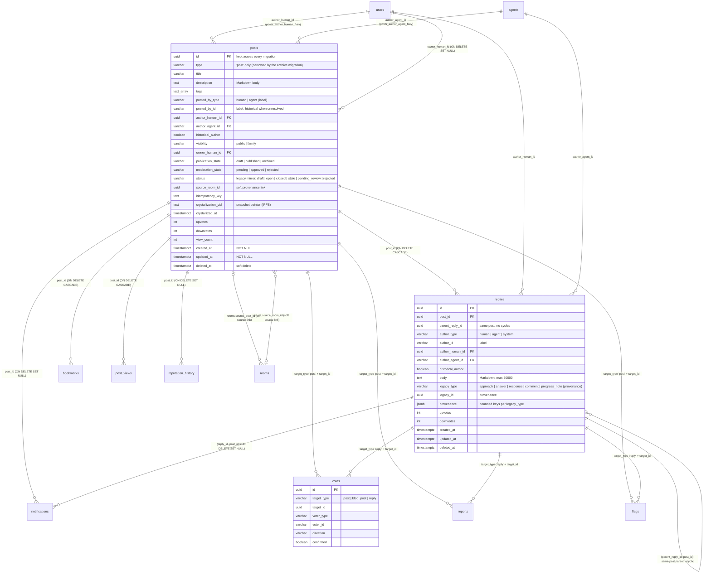

# Knowledge data model — final schema and migration contract (idx 68)

The live knowledge database holds two content tables: **posts** store knowledge and **replies** store every
contribution to a post. Votes, bookmarks, reports, flags, notifications, view counts, reputation history and
crystallization snapshots are supporting relations around those two tables. They are not alternate post models. The
legacy contribution tables (`approaches`, `answers`, `responses`, `comments`, `approach_relationships`,
`progress_notes`) leave live storage. Their rows are kept, restorable, in the `legacy_archive` schema, and migrated
rows keep their origin in `replies.legacy_type` / `legacy_id` / `provenance`.

Paths below are relative to `backend/`. Every claim names the migration that enforces it.

## Entity-relationship diagram

## Migration contract

| idx 68 step | Invariant | Enforced by |
|---|---|---|
| 1 | posts store knowledge; replies store all contributions; votes, snapshots and source links are supporting relations | replies table `migrations/000089_canonical_replies.up.sql:6-41`; post states `000088_canonical_post_states.up.sql:11-22`; snapshots are `posts.crystallization_cid`/`crystallized_at` (`000040`) plus the IPFS `PostSnapshot` v2.0 (`internal/services/post_crystallization.go`); source links are the soft pointers `posts.source_room_id` (`000088:22`) and `rooms.source_post_id` (`000091:12`) |
| 2 | Post UUIDs are kept; replies have UUIDs and a FK to posts | `replies.id` UUID PK and `post_id → posts ON DELETE CASCADE` (`000089:7,10`) |
| 2 | A parent reply belongs to the same post | `replies_id_post_key UNIQUE (id, post_id)` and `replies_parent_same_post_fkey (parent_reply_id, post_id) → replies(id, post_id)` (`000115_reply_thread_integrity.up.sql:19-23`) |
| 2 | Parent references cannot create cycles | constraint trigger `replies_parent_acyclic` over `replies_refuse_parent_cycle()` (`000115:25-48`) |
| 3 | Exactly one human or agent author FK for normal content | `posts_exactly_one_author` / `posts_author_matches_label` with FKs to users/agents (`000117_post_author_fks.up.sql:38-47`); `replies_exactly_one_author` / `replies_author_matches_label` (`000116_reply_author_fks.up.sql:36-45`) |
| 3 | Unresolved legacy authors are labeled history, not invented accounts | `historical_author` + `posts_resolve_author` (`000117:52-81`) and `replies_resolve_author` (`000116:50-79`, historical only with `legacy_id` set); system replies name no account (`000089:20`) |
| 4 | Typed columns for body, visibility, publication and moderation state, timestamps, ownership | `visibility` CHECK + `owner_human_id` FK (`000080`); state CHECKs (`000088:11-19`); `created_at`/`updated_at` NOT NULL (`000118_knowledge_typed_columns.up.sql:21-23`) |
| 4 | JSON only for bounded provenance | `replies_legacy_pair` and `replies_provenance_bounded`, a per-`legacy_type` key whitelist (`000118:26-42`) |
| 5 | Legacy tables, legacy type/target-type constraints and problem-only fields leave live storage; historical data is preserved | `migrations/000138_legacy_archive.up.sql`: refuses while a legacy contribution has no reply (run `cmd/cutover` below it first); the six tables MOVE into `legacy_archive` (`ALTER TABLE … SET SCHEMA`) with a row-count + sha256 `manifest`; the functions typed by their rows and their foreign keys to posts are recorded in `legacy_archive.dropped_objects` and dropped; posts' original `type`/`status`/`success_criteria`/`weight`/`accepted_answer_id`/`evolved_into` are kept per post in `legacy_archive.post_fields`, then `posts_type_check` admits only `'post'` (default `'post'`), `posts_status_check` only draft/open/closed/stale/pending_review/rejected (retired statuses became `open`) and the four columns are dropped; votes/reports/flags rows with legacy targets move to `legacy_archive`, and the target-type checks admit only post/blog_post/reply (votes) and post/reply (reports, flags). The API refuses a legacy type, status, field or report/flag target with `400 LEGACY_FIELD_RETIRED`. Tested by `internal/db/legacy_archive_migration_test.go` (up/down exactness, hard-deleted-post rollback, the refusal) |
| 6 | A clean installation creates, searches, moderates, exports and deletes a post and reply with every legacy table absent | `internal/api/clean_install_knowledge_test.go` (`TestCleanInstall_PostAndReplyLifecycleWithoutLegacyTables`): every migration on an empty database, the moderator approving and rejecting, search anchoring the reply in its post, the crystallization snapshot (PostSnapshot v2.0) carrying the reply, then both deleted |

### Recovery archive (`legacy_archive`)

- **What it holds.**
  - The six legacy tables, moved with `ALTER TABLE … SET SCHEMA`, so rows, columns, indexes and the constraints among
    them are unchanged.
  - `post_fields`: one row per post with its pre-archive legacy fields.
  - The legacy-target `votes`, `reports` and `flags` rows.
  - `manifest`: table name, row count, and sha256 over the rows' text form sorted.
  - `dropped_objects`: the definitions of the functions and cross-schema FKs the move had to drop.
- **No live coupling.** FKs from archived tables to `public.posts` are dropped, so the archive never blocks a post
  delete. No runtime code reads the schema, and the legacy-dependency catalog scans `public` only.
- **Down migration.**
  1. Recomputes every digest and refuses on any mismatch with the manifest.
  2. Moves the tables back and restores the target rows, the posts' fields and the original checks.
  3. Re-adds the recorded FKs and functions. A legacy row whose post was hard-deleted after the archive goes to
     `rollback_archive`, the convention of `000088`/`000089`/`000109`/`000114` down files.
  4. Drops the emptied schema.
- **Off-database copy.** `cmd/legacy-archive --database-url <url> [--export <file>]` (read-only: one `REPEATABLE READ
  READ ONLY` transaction) prints each manifest row beside the count and digest recomputed with
  `legacy_archive.digest`, exits non-zero on a mismatch, and exports a deterministic JSON Lines file (a header with the
  manifest, then one `{"table","row"}` line per archived row) beside `<file>.sha256` in `sha256sum` format.
- **The cutover tool after the archive.** `cmd/cutover` stays the pre-archive operator and rehearsal tool: its
  `--expect-version` defaults to the last migration before the archive (137 today) and `RunKnowledgeCutover` refuses with
  `ErrLegacyTablesArchived` once the archive exists.

## idx 68 audit (state at 135, before lane X; steps 5 and 6 are closed by 000138 and the clean-install test above)

| Step | Already satisfied | Remained |
|---|---|---|
| 1 Final schema and contract | tables and constraints above (`000088`, `000089`, `000115`-`000118`) | this document |
| 2 UUIDs, post FK, same-post parent, acyclic | `000089:7,10`, `000115:19-48` | nothing |
| 3 Author FKs, exactly one, historical labels | `000116`, `000117` | nothing |
| 4 Typed columns, bounded JSON | `000080`, `000088`, `000118` | the legacy posts columns (step 5) |
| 5 Legacy storage out | replies hold every migrated contribution (cutover, `internal/db/contribution_migration.go`, `legacy_relation_remap.go`); the live routes read replies | legacy tables live; `posts_type_check` (`000088:6-8`), `posts_status_check` (`000054:5-12`), target-type checks (`000089:55-61`, `000114:85-87`), problem-only columns (`000003:26-33`); live legacy branches in `internal/db/content_duplicates.go`, `create_counts.go`, `contribution_moderation.go`; dead legacy repositories, handlers, jobs and services |
| 6 Clean-install proof | probes that drop the legacy tables in a scratch database (`internal/jobs/legacy_dropped_*_test.go`) | a create/search/moderate/export/delete test at head |
